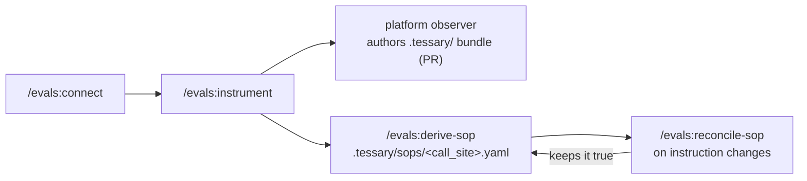

# evals

A Claude Code plugin that connects your repo to [evals.tessary.ai](https://evals.tessary.ai) and lets
you work with your evals **from the coding agent** — assess call sites, inspect graders, query
failing traces, and read the cases and root-cause reports the platform has opened, all as native
read tools. Grader authoring itself lives on the platform:
its observer reads your repo, proposes the `.tessary/` eval bundle as a draft PR, and keeps it
current as your code changes.

## Install

In any Claude Code session:

```
/plugin marketplace add tessaryai/plugins
/plugin install evals@tessary
```

## Connect (start here)

```
/evals:connect
```

> **Start here, always.** The order is `/evals:connect` → [`/evals:instrument`](#bind-your-call-sites-evalsinstrument)
> → exercise your app → [connect the repo on the platform](#how-graders-come-to-exist). Grader
> authoring reads your project's real traces and your code, so it needs a link, tagged telemetry,
> and a readable repo before it can produce anything worth running.

This links the current repo to a project on evals.tessary.ai (a one-time device-code handshake in
your browser), then registers the platform's authenticated tools into Claude Code — privately, scoped
to this repo. After you reconnect the session, just ask the agent things like:

- **"assess my call sites"** — it lists them and flags gaps, risky calls, and missing coverage
- **"what's failing this week?"** — it queries real spans and classifier events
- **"what's wrong with this project?"** — it pages the open cases worst-first, and reads the
  root-cause report on any one of them
- **"show me the conversation that failed"** — it finds the span and reads its raw payload
- **"show the grader for `<call site>`"** — it pulls the definition and recent verdicts

The link stores a project-scoped token under `~/.config/tessary-evals/credentials.json` and, because
the MCP server is registered at **local scope** (`~/.claude.json`), the token is never written into a
committed file. Reconnect once after connecting so the tools load. To disconnect a repo later, run
`python3 platform.py unlink` (removes the local registration + stored credential).

### What you get natively after connecting

The platform exposes these as MCP tools the agent calls directly — no local files, no Python per read.
**All of them read; none writes, spends, or starts an agent run.**

| Tool | What it does |
| --- | --- |
| `get_project` | What this token is bound to — start here; no other tool takes a project argument. Carries the `watching` block: classifiers enabled, call sites swept, traces in the last 24h |
| `list_cases`, `get_case` | **What is wrong right now**: open cases worst-first, filterable by detector or call site, paged. `get_case` brings the root-cause report **inline** once one has finished |
| `list_findings`, `get_finding` | Classifier drift findings — the aggregated cause behind many firings |
| `list_call_sites`, `list_failure_modes`, `list_quality_dimensions` | Inventory the imported pipeline taxonomy |
| `list_traces`, `get_trace` | Find a trace by model, kind, call site, environment, status or keyword; then read the whole conversation with full payloads |
| `list_spans`, `get_span` | The step grain — one LLM call, tool call or sub-agent. Keyword or semantic search, nine filters; `get_span` returns one span's **raw payload** |
| `list_sessions`, `get_session` | One continuous interaction with one user, spanning many traces, with its totals |
| `describe_dataset` | What each query dataset can be faceted and filtered by — read this instead of guessing a field name |
| `query_count`, `query_timeseries`, `query_facets` | Aggregate over spans, tool calls, classifier events, and usage/cost rollups |
| `query_search` | Row search over `tool_calls` and `classifier_events`. **Spans search lives on `list_spans`** |
| `list_graders`, `get_grader` | Read a grader's definition with the curation overlay applied |

**This table is a summary, not the contract.** `tools/list` is the authoritative catalogue and it answers
*per token*: each tool declares a capability your org must hold to be offered it, so your project may be
offered fewer tools than are listed here, and one your org does not hold reads as an unknown tool rather than
a permission error. Graders is now the **only** gated group — nine of the rows above are the surface's plural
readers and every one of them is open. Ask the server rather than assuming a fixed list — a hand-maintained
copy is what left this table advertising a no-op for two releases, and then five tools that no longer exist.

**Lists find, gets read.** A list row carries typed columns and the stored input/output previews, never the
full payload: fifty conversations is not a list, it is a context window spent before you have decided which
trace you care about. Raw text comes from `get_span` / `get_trace`, or from `list_spans` with
`fields: ["payload"]` on a page already narrowed to one trace or to a window of at most 24h.

**Triage is a UI action.** There is no `run_triage` tool — a triage run is a platform-paid agent session, so
starting one stays with a person. What reaches you is its output: `get_case` inlines the finished report.

## Make traces flow (OTLP)

Connecting only gives you *read* access — it's useful once traces are actually reaching your
project. **Ingestion is OpenTelemetry over OTLP** (`POST /v1/traces`) — there is no JSON upload,
and the plugin does not install any SDK. `/evals:connect` detects whether your repo already emits
OpenTelemetry and, if so, wires its export to the project.

If your app already emits OpenTelemetry, point its OTLP exporter at your project with the standard
env vars (the token comes from the device link, kept out of version control):

```
OTEL_EXPORTER_OTLP_ENDPOINT=https://evals.tessary.ai
OTEL_EXPORTER_OTLP_HEADERS=Authorization=Bearer <your link token>
OTEL_EXPORTER_OTLP_PROTOCOL=http/protobuf
```

Run your app and traces appear in the project — ready to assess, or to author graders against.
If your app has no OpenTelemetry yet, follow the project's **Connect traces** step for the setup
guide; any OpenTelemetry-capable emitter works.

## Bind your call sites (`/evals:instrument`)

Traces arriving is not the same as traces being *usable*. The eval machinery is call-site-keyed, and
the platform learns a span's call site from exactly one thing — the explicit **`tessary.call_site.id`**
span attribute. There is no filepath or span-name inference: an untagged span ingests fully, shows up
in the trace viewer, and is **invisible to every call-site-scoped feature**.

```
/evals:instrument
```

finds the LLM call sites in your repo, gives each a stable id, and writes that id into your code as a
span attribute (showing you the diff first). The tagged call sites then materialize themselves in the
project the first time a tagged span arrives — no upload required.

Check what landed:

```
python3 platform.py envs                     # tagged spans + call sites, per environment
python3 platform.py coverage --env prod      # per-call-site counts, plus the untagged residue
```

## How graders come to exist

There is no local generation step. Once the three preconditions hold —

1. the repo is **linked** (`/evals:connect`),
2. its call sites are **tagged and producing traffic** (`/evals:instrument`, then exercise the app),
3. the repo is **connected on the platform** (Settings → Git integration — the GitHub App),

— the platform's **observer** authors the eval bundle for you, on your org's schedule: it reads the
code, writes the `.tessary/` bundle (call-site shards, code-tracked facts like output schemas and
tool declarations, failure modes, quality dimensions, grader definitions), and opens a **draft PR**
against your repo. You review and merge; the merge imports the bundle into the platform. The
imported graders are definitions without verdict bodies yet — generate the bodies from real traces
with the **Generate** action on the project's Pipeline page (a deliberate, spend-incurring step, so
it is yours to trigger, not automatic). The same loop keeps the bundle current as your code
changes — every update arrives as a PR, never a silent write.

The `.tessary/` directory in your repo is the **source of truth**: you can edit any of it directly
(adjust a grader's gate, retire a failure mode, fix a description) and the platform imports your
version on push. The bundle's format is documented in [`output_format.md`](output_format.md); grader
authoring rules live in [`contract/AUTHORING_CONTRACT.md`](contract/AUTHORING_CONTRACT.md).

## Author the conformance SOP (`/evals:derive-sop`, `/evals:reconcile-sop`)

The platform's **SOP-conformance classifier** watches a call site's production traffic for drift
from its own standing procedure. What it needs from the repo is one **v3 SOP file per call site**
(`.tessary/sops/<call_site_id>.yaml`): seven concepts — `agent`, `intents`/`means`,
`observations`, `rules` (`in`/`when`/`unless`/`at` + `expect`|`never`) — **pure meaning, zero
mechanism**. Detectors, thresholds, and bindings are compiled server-side by the platform and
never appear in the file. The schema is specified in the evals-platform repo
(`classifiers/experiments/SCHEMA-V3.md`).



- **`/evals:derive-sop`** reads the call site's *whole* instruction surface — system prompts, tool
  definitions, routing rules, wherever instructions live, duplicated or disjoint — and distills it
  into intents, an atomic observation vocabulary (harvesting `counts:`/`counts_not:` frame
  exemplars from the prompt's own clarifying asides), and rules mapping every instruction to
  enforced-or-deferred. Contradictions between duplicated instruction sources come back to you as
  findings, not silent choices.
- **`/evals:reconcile-sop`** is the per-commit maintenance flow: re-read the whole surface (the
  SOP stores **no provenance anchors, by design** — pointers rot), verify every sentence is still
  true, and propose edits/retirements/additions with the evidence quoted in the proposal only.
- **`sop_lint.py`** is the vendored validator both skills run (Python 3 + PyYAML, nothing else):
  seven-concept parse with collect-all validation plus the style-law lint — atomicity errors,
  unknown refs, exemplar shape, hedge-word and `never:`-polarity warnings. Worked examples ship
  in [`sop_examples/`](sop_examples/); try it:

  ```bash
  python3 sop_lint.py sop_examples/policy_gpt.yaml sop_examples/broken.yaml
  ```

> **The deliverable is the authored, linted file in your repo.** Getting the SOP into the platform
> is currently an ops-side seam — there is no tenant-facing upload endpoint yet — so the platform
> team wires it in from the repo; nothing further to run locally.

## License

MIT — see `LICENSE`.
